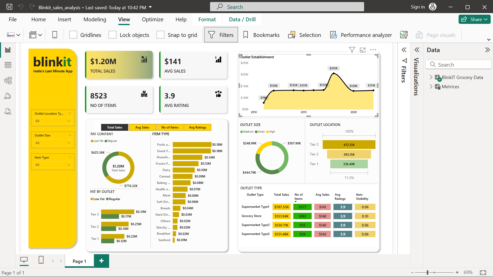

<div align="center">


# 🛒 Blinkit Sales Performance Dashboard

**An end-to-end Power BI analytics project analyzing $1.20M+ in grocery sales across outlet types, locations, and product categories.**

[](https://powerbi.microsoft.com/)
[](https://www.microsoft.com/en-us/microsoft-365/excel)
[]()
[]()

</div>

---

## 📌 Table of Contents

- [Project Overview](#-project-overview)
- [Dashboard Preview](#-dashboard-preview)
- [Dataset](#-dataset)
- [Key Insights](#-key-insights)
- [Dashboard Features](#-dashboard-features)
- [Repository Structure](#-repository-structure)
- [Tools & Technologies](#%EF%B8%8F-tools--technologies)
- [How to Use](#-how-to-use)
- [Author](#-author)

---

## 📖 Project Overview

This project analyzes **Blinkit's** (India's last-minute grocery app) retail sales data to uncover performance patterns across outlet types, product categories, and geographic tiers. The interactive Power BI dashboard empowers stakeholders to:

- Monitor revenue trends across a **12-year establishment window (2011–2022)**
- Compare outlet performance by size, type, and tier location
- Understand product category contributions to total sales
- Identify opportunities to improve average customer ratings

> **Business Problem:** Blinkit operates diverse outlet formats across multiple city tiers. Understanding which outlet configurations and product mixes drive the highest sales is critical for expansion and inventory decisions.

---

## 📸 Dashboard Preview

<div align="center">
  
</div>

> **[▶ Download the Power BI file](Blinkit_sales_analysis_Dashboard.pbix)** to interact with live filters, slicers, and drill-throughs.

---

## 📊 Dataset

The raw dataset contains **8,523 rows × 12 columns** covering individual item-level transactions across all Blinkit outlets.

| Column | Description | Type |
|---|---|---|
| `Item Identifier` | Unique product ID | Text |
| `Item Type` | Product category (16 categories) | Categorical |
| `Item Fat Content` | Low Fat / Regular | Categorical |
| `Item Weight` | Weight of the product | Numeric |
| `Item Visibility` | Shelf visibility score | Numeric (0–1) |
| `Outlet Identifier` | Unique outlet ID | Text |
| `Outlet Establishment Year` | Year the outlet was established | Numeric |
| `Outlet Size` | Small / Medium / High | Categorical |
| `Outlet Location Type` | Tier 1 / Tier 2 / Tier 3 | Categorical |
| `Outlet Type` | Supermarket Type1/2/3 or Grocery Store | Categorical |
| `Sales` | Item sales revenue (USD) | Numeric |
| `Rating` | Customer satisfaction rating | Numeric |

📁 **Raw data:** [`data/BlinkIT_Grocery_Data.xlsx`](data/BlinkIT_Grocery_Data.xlsx)

---

## 💡 Key Insights

### 🏆 Overall Performance
| Metric | Value |
|---|---|
| **Total Sales** | $1.20M |
| **Average Sales per Item** | $141 |
| **Total Items Tracked** | 8,523 |
| **Average Customer Rating** | 4.0 / 5.0 |

---

### 🏪 Outlet Type Performance

| Outlet Type | Total Sales | No. of Items | Avg Sales | Avg Rating |
|---|---|---|---|---|
| Supermarket Type1 | **$787.55K** | 5,577 | $141 | 3.9 |
| Grocery Store | $151.94K | 1,083 | $140 | 3.9 |
| Supermarket Type3 | $130.71K | 935 | $140 | 3.9 |
| Supermarket Type2 | $131.48K | 928 | $142 | 3.9 |

> 📌 **Supermarket Type1** outlets alone account for **~65% of total revenue**, making them the highest-priority format for business growth.

---

### 📍 Location-Based Sales

| Tier | Sales Share |
|---|---|
| Tier 3 (Rural) | **$472.13K — 39.3%** |
| Tier 2 (Semi-urban) | $393.15K — 32.7% |
| Tier 1 (Urban) | $336.40K — 28.0% |

> 📌 **Tier 3 locations outperform urban Tier 1**, suggesting strong demand in semi-rural and rural markets — a key opportunity for further expansion.

---

### 🧺 Top Product Categories by Sales

| Rank | Category | Sales |
|---|---|---|
| 1 | Fruits & Vegetables | $0.18M |
| 2 | Snack Foods | $0.18M |
| 3 | Household | $0.14M |
| 4 | Frozen Foods | $0.12M |
| 5 | Dairy | $0.10M |

---

### 🏗️ Outlet Size Contribution

- **Medium outlets** generate the highest sales volume
- **Small outlets** contribute significantly despite limited floor space
- **High (large) outlets** have the fewest locations but higher per-outlet revenue

---

### 📈 Establishment Trend

Sales peaked sharply for outlets established around **2018**, followed by a normalization — pointing to a period of aggressive expansion whose returns have since stabilized.

---

## ✨ Dashboard Features

| Feature | Description |
|---|---|
| 🎛️ **Interactive Slicers** | Filter by Outlet Location Type, Outlet Size, and Item Type |
| 📊 **KPI Cards** | At-a-glance view of Total Sales, Avg Sales, Item Count, and Avg Rating |
| 🍩 **Donut Chart** | Fat content (Low Fat vs Regular) breakdown by total sales |
| 📉 **Line Chart** | Outlet establishment year vs. sales trend (2011–2022) |
| 📊 **Bar Charts** | Item Type and Fat-by-Outlet sales comparison |
| 🗂️ **Matrix Table** | Full outlet type breakdown with color-coded performance metrics |
| 🔵 **Donut Chart** | Outlet size (Small / Medium / High) share of total revenue |
| 📊 **Stacked Bar** | Outlet location tier sales distribution |

---

## 🗂️ Repository Structure

```
Blinkit-Sales-Analysis/
│
├── 📁 data/
│   └── BlinkIT_Grocery_Data.xlsx       # Raw dataset (8,523 rows × 12 cols)
│
├── 📁 dashboard/
│   └── Blinkit_sales_analysis_Dashboard.pbix   # Power BI dashboard file
│
├── 📁 assets/
│   └── images/
│       └── dashboard_preview.png       # Dashboard screenshot
│
└── README.md                           # Project documentation
```

---

## 🛠️ Tools & Technologies

| Tool | Purpose |
|---|---|
| **Microsoft Power BI** | Dashboard design, DAX measures, and interactive visualizations |
| **Microsoft Excel** | Raw data storage and initial exploration |
| **Power Query** | Data cleaning, type standardization, and transformation |
| **DAX (Data Analysis Expressions)** | Custom KPI calculations (Total Sales, Avg Sales, Item Visibility) |

---

## 🚀 How to Use

1. **Clone this repository**
   ```bash
   git clone https://github.com/YourUsername/Blinkit-Sales-Analysis.git
   ```

2. **Open the dashboard**
   - Ensure [Power BI Desktop](https://powerbi.microsoft.com/en-us/desktop/) is installed (free)
   - Open `dashboard/Blinkit_sales_analysis_Dashboard.pbix`

3. **Explore the data**
   - Use the slicers on the left panel to filter by **Outlet Location**, **Outlet Size**, or **Item Type**
   - Hover over charts for detailed tooltips
   - Click chart elements to cross-filter the entire dashboard

4. **Refresh with new data** *(optional)*
   - Replace `data/BlinkIT_Grocery_Data.xlsx` with updated data
   - Click **Home → Refresh** in Power BI Desktop

---

## 👤 Author

**Your Name**
- 🔗 [LinkedIn](https://linkedin.com/in/yourprofile)
- 💻 [GitHub](https://github.com/YourUsername)
- 📧 your.email@example.com

---

<div align="center">

⭐ If you found this project helpful, please consider **starring the repository!**

</div>
